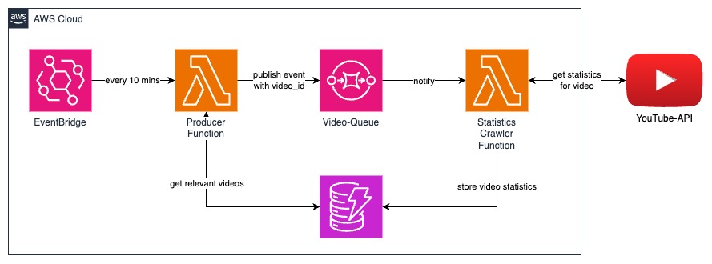

# Youtube-API-DynamoDB

Small example implementation which regularly retrieves data from the youtube-api and stores them in AWS DynamoDB through a combination of AWS-SQS and AWS-Lambda.

## Architecture

## Features
- highly scalable pipeline to extract information from yt-api
- validation of data flow with pydantic
- Infrastructure as Code with terraform
- automated testing and deployment with github actions
- high test coverage

